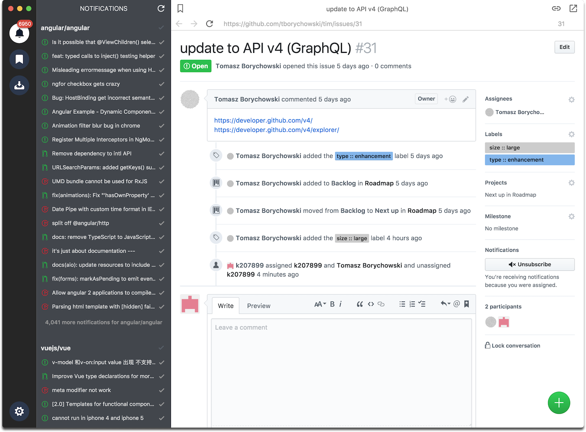
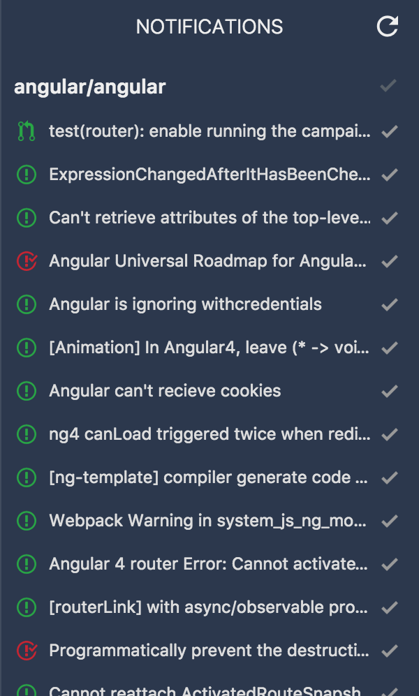
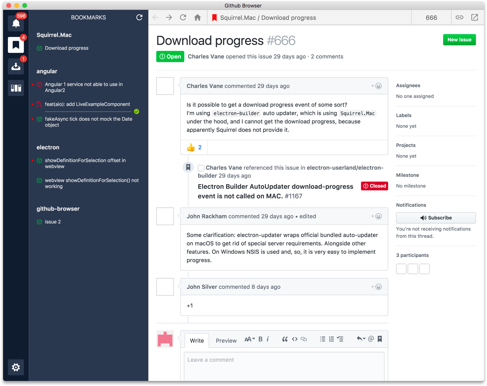
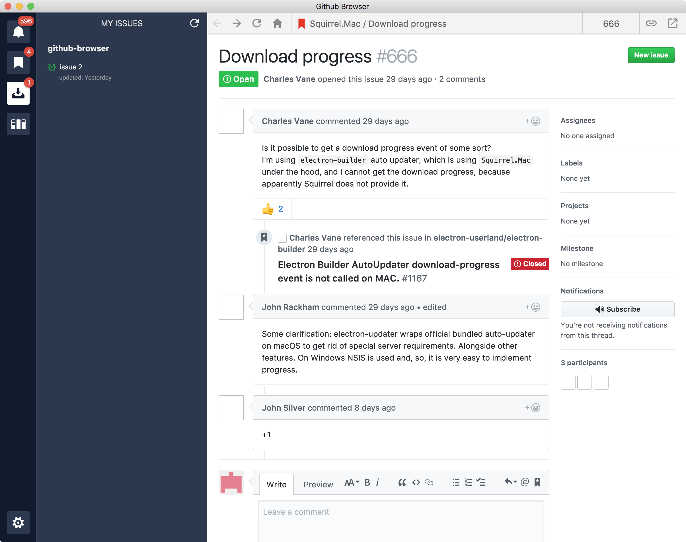
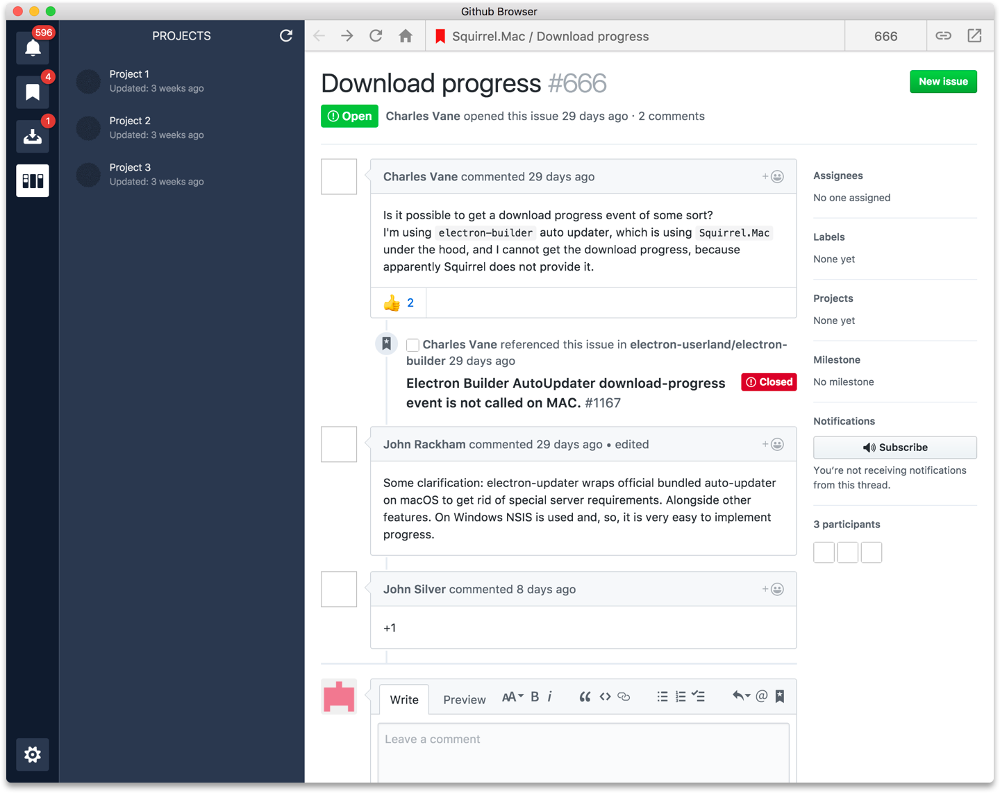
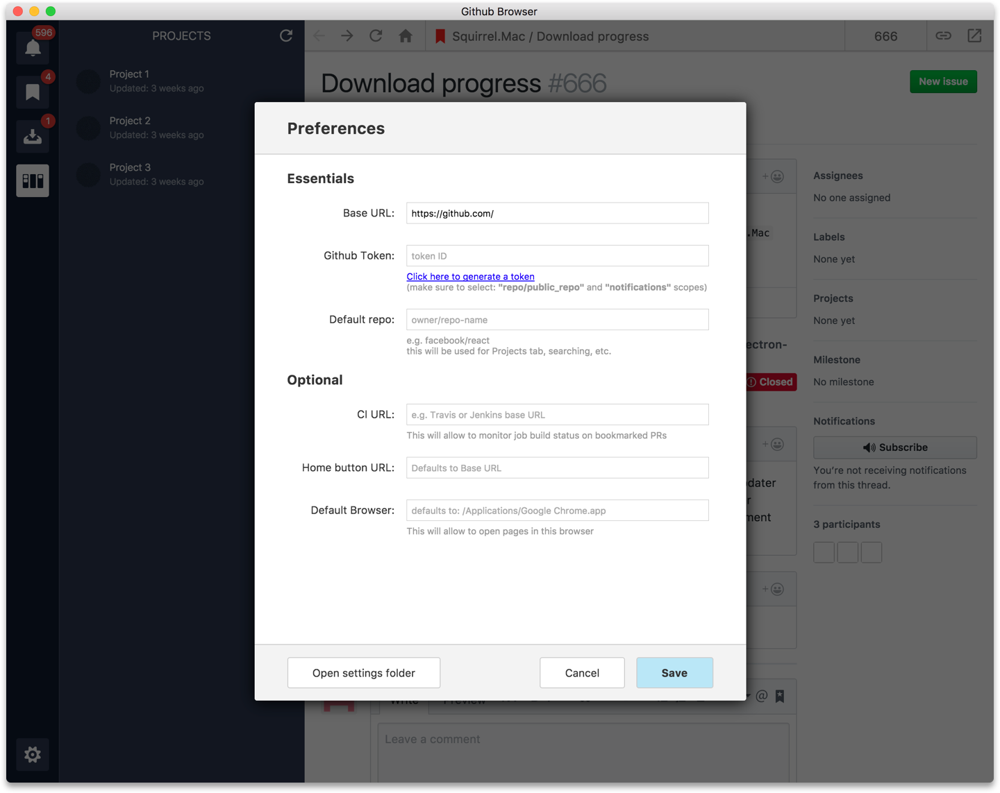

# Github Browser
Browse github orderly.



## Features
- Gives you **only 1 page** (no tabs, no clutter. just focus). If you really, really must see a link in another window you can use "Preview" feature (cmd+click or right-click on a link/image) or open it in your designated browser (chrome by default)
- Minimalist & extremely functional design
- Dock **badge** shows the number of unread notifications
- Tweaked github css to make it responsive and hide unimportant blocks (headers, footers)
- Shows real names instead of logins (e.g. in comments)
- **Auto updater** (like chrome - updates the app in the background)
- Works with **Github Enterprise**
- **TouchBar** Support


## Download
Check the [Releases](https://github.com/tborychowski/github-browser/releases) for the latest version.


## More Screenshots

#### Notifications 
- quickly see what's going on, 
- dismiss merged PRs without leaving the page




#### Bookmarks
- stash any page
- issue/PR pages are grouped by repository name
- PR bookmarks will show build job progress and status (only jenkins for now)
- red dot will show you if there are new comments on an issue/PR since you bookmarked it
- type icon (issue or PR) will change colour based on the status (open - green; closed - red) - like in GH




#### My Issues
- list all issues assigned to the currenlty logged-in user (based on the token provided in settings)
- like bookmarks - shows icon colour based on the status and red dot for unread comments




#### Projects
- a view of all projects for the default repository (provided in Settings)



#### Settings



## Dev install
```sh
git clone https://github.com/tborychowski/github-browser.git
cd github-browser
npm i
npm start
```


## License
*MIT*
